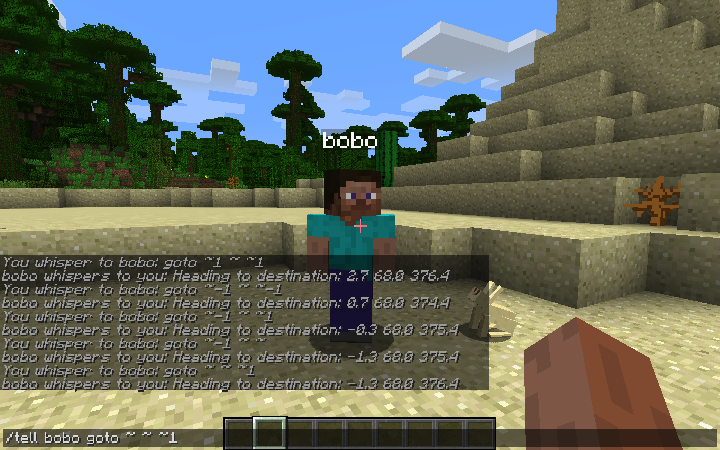

# mc-roboto

A MineCraft client library with dynamic protocol capability for building an Autonomous Agent (robot).

**Status**: *Alpha* (experimental)

##Features

 - dynamic protocol - can switch to use the protocol version you specify at runtime (uses data from the [PrismarineJS minecraft-data project](https://github.com/PrismarineJS/minecraft-data.git))
 - handles compression
 - event-driven framework

##Limitations

- does not (currently) handle online mode (aka encryption)
- example robot is really, *really* simple 😉

##Platform

- python3
- OS X [*1*]

[*1*] This is what I develop and test on. It *might* work on other systems...but your mileage may vary.

##Requirements

* minecraft-data (linked submodule)
* virtualenv

##Installation

1. clone this repo
1. create a virtualenv and activate it:
	1. `virtualenv venv`
	1. `source venv/bin/activate`
1. install the dependencies:
	1. `pip install -r requirements.txt`

##Usage

There are a couple of hard-coded defaults that you may wish to change:

- server: *localhost*
- port: *25565* (default MineCraft server port)
- robot name: *bobo*

These can be searched for and changed in main.py if so desired.

To run the program:

1. `python main.py`
2. the program should launch, connect to the server, and spawn your robot player into the world
3. you can then chat with your robot, using the /tell [*robot name*] command:
	- i.e. `/tell bobo goto ~ ~ ~1`
